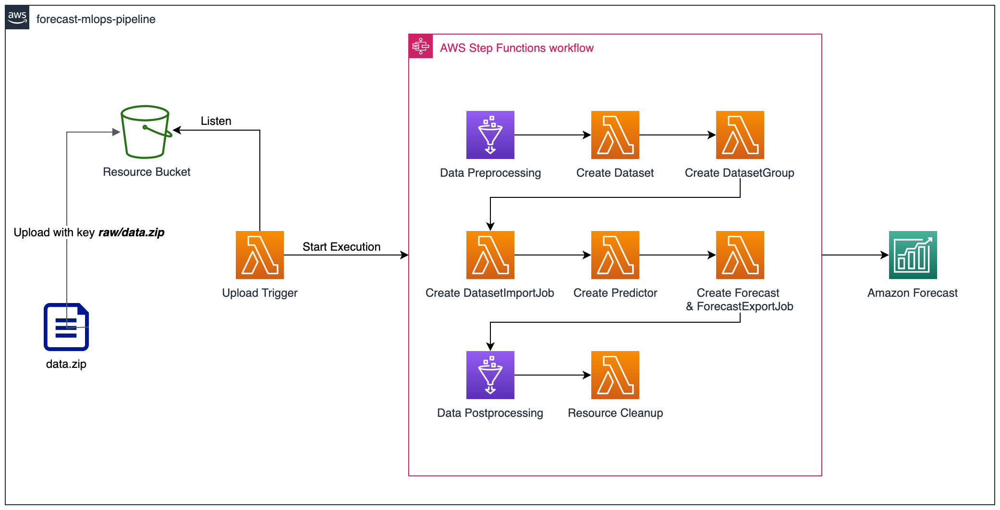

# amazon-forecast-mlops-pipeline-cdk

> This CDK implementation demonstrates how Amazon Forecast workflow can be automated with AWS Serverless Services.

## Prerequisites

AWS CDK v2 is required to deploy this application.
See [Installation Guide](https://docs.aws.amazon.com/cdk/latest/guide/work-with-cdk-typescript.html) to install AWS CDK in TypeScript.  

Once complete with the previous step, run below command on the root of this project to deploy the pipeline.

```bash
cdk deploy ForecastMlopsPipelineStack
```

If successfully deployed, we are ready to launch 🚀🚀🚀


## Solutions Architecture



This package contains a CDK implementation of a MLOps Pipeline for Amazon Forecast. The pipeline automatically performs Amazon Forecast operations and relevant operations. Basically, each of the operations are either implemente with AWS Lambda or AWS Glue, and the entire operations are orchestrated by AWS Step Functions.

The pipeline consist of the following steps:

### Data Preprocessing
Implemented in Glue Python Job. Performs data operations defined in python scripts. The current code does nothing but printing out dataset files, but you can add your own preprocessing logics using pandas, NumPy, sklearn, etc.

### DatasetGroup Creation
Implemented in Lambda Function. Creates Amazon Forecast DatasetGroup. 

### Dataset Creation
Implemented in Lambda Function. Creates Amazon Forecast Datasets. 

### DatasetImportJob Creataion
Implemented in Lambda Function. Creates Amazon Forecast Dataset Import Job for each Dataset. 

### Predictor Creation
Implemented in Lambda Function. Creates Amazon Forecast Predictor for training. 

### Forecast & ForecastExportJob Creation
Implemented in Lambda Function. Creates Amazon Forecast Forecast and ForecastExportJob. After Forecast & ForecastExport is created, forecast result will be saved in Resource Bucket as csv files.

### Data Postprocessing
Implemented in Glue Python Job. By default, Amazon forecast exports results in separate files, but this is inconvenient in some cases. Thus, Data Postprocessing Glue Job merges forecast results into a single file. As mentioned in preprocessing step, you can add your own postprocessing logics in this step too, using pandas, NumPy, sklearn, etc.

### Resource Cleanup
Implemented in Lambda Function. Cleans up Amazon Forecast Resources created in above steps. Result files in S3 Bucket will not be deleted even if Forecast Resources are delete. You can either skip this step by configuring `PerformDelete` to `false` in __forecast-config.json__. 


## How to Run

This section explains how to trigger the pipeline to run Amazon Forecast from end to end. Follow the instructions in order.

### Prepare Dataset

Prepare your own dataset in csv files formatted for Amazon Forecast.
See this [link](https://docs.aws.amazon.com/forecast/latest/dg/howitworks-datasets-groups.html) for details aboout Amazon Forecast dataset format.

For those who want to execute the pipeline before preparing your own dataset, sample dataset is included in this project. Please see __sample-data/data.zip__.

> In __sample-data/data.zip__, `TTS.csv` contains monthly sales history of instruments in Amazon Forecast Target Time Series format. `IM.csv` contains metadata, which instrument category of each item, in Amazon Forecast Item Metadata format.

When you prepare your own dataset, be sure to match the directory structure of the dataset file __data.zip__. The directory structure should look like below.

```bash
data.zip
│────TTS.csv # mandatory
│────IM.csv  # optional, may not exist
└────RTS.csv # optional, may not exist
```

> Please note that the names of csv files should be one of `TTS.csv` / `IM.csv` / `RTS.csv`.


### Prepare Configuration JSON

To use Amazon Forecast, you have to find out proper values for a bunch of configurations. For example, which algorithm to train, how to fill missing value, etc. 

To tell the pipeline all the detailed configurations, you have to write a json file and put it into Resource Bucket. 

As well as the dataset, an example for configurations is also provided within this project. Please see __sample-data/forecast-config.json__. This example is for training a CNNQR model with the dataset given in __sample-data/data.zip__.

Otherwise, you can use this pipeline on your own dataset. If you want to do so, make sure to properly setup __forecast-config.json__ by referring to __sample-data/forecast-config.json__.

Since this pipeline uses boto3 package for Amazon Forecast API calls, the schema of __forecast-config.json__ corresponds to boto3 API parameter schema. To add other configuration variable that doesn't appear on __sample-data/forecast-config.json__, see [Boto3 Developer Guide](https://boto3.amazonaws.com/v1/documentation/api/latest/reference/services/forecast.html).


### Upload to Launch

Finally, you are ready to launch the pipeline. After you deploy this pipeline,
you will see an S3 bucket named `forecast-mlops-pipeline-resource-bucket-{YOUR-12DIGIT-AWS-ACCOUNT-ID}`. All you have to do now is to upload files prepared from the previous steps. 

First, you have to upload your __forecast-config.json__ to the bucket by either using AWS CLI or AWS Console:

```bash
aws s3 cp forecast-config.json s3://forecast-mlops-pipeline-resource-bucket-{YOUR-12DIGIT-AWS-ACCOUNT-ID}
```

And then upload your on data.zip file to __raw/__ directory in the same bucket.

```bash
aws s3 cp data.zip s3://forecast-mlops-pipeline-resource-bucket-{YOUR-12DIGIT-AWS-ACCOUNT-ID}/raw
```

> You should upload `data.zip` as the final step because `raw/*.zip` is registered as the upload trigger key of the pipeline. Therefore the pipeline will be triggered immediately after `raw/data.zip` is uploaded. To avoid any unintended failure, upload `forecast-config.json` files before the dataset, `raw/data.zip`.


Navigate to the StepFunctions console to monitor the excecution. You will see the progress like below while execution.


When the steps are completed, the __Resource Bucket__ will have the following structure:

```bash
forecast-config.json    # Your pipeline configuration file.
raw/                    # Where you uploaded the raw dataset
input/                  # Where preprocessed csv files are stored
export/                 # Where raw forecast csvs generated by Amazon Forecast are stored
forecast/               # Where postprocessed and merged csv file is stored
```


## Project Structure
This project follows typical AWS CDK project structure. The below directories are important from the user perspective.

```bash
bin/                    # Entrypoint of the entire project
lib/                    # CDK Constructs and Stacks are defined
lambda/                 # Python scripts for Lambda Functions
glue/                   # Python scripts for Glue Jobs
```


## 👀 Got Problems?

Please open an issue to let the maintainer know. Or PR would be also appreciated.
The maintainer will reach out!

## Security

See [CONTRIBUTING](CONTRIBUTING.md#security-issue-notifications) for more information.

## License

This library is licensed under the MIT-0 License. See the LICENSE file.
